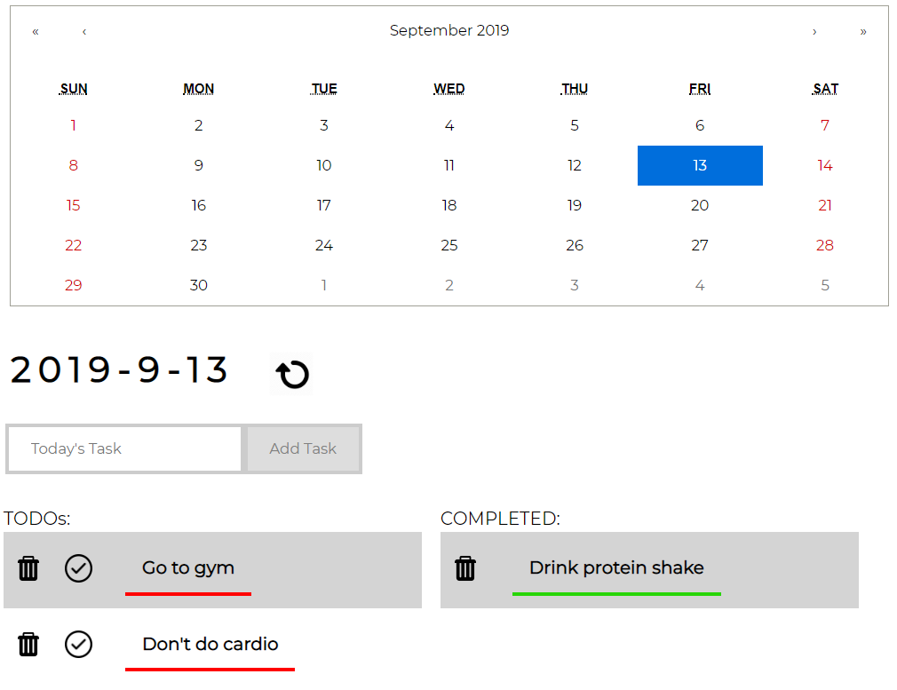

# Daily Planner
Welcome to Daily Planner!

## Summary
Daily Planner is a React app to help users organize their daily tasks.
Users can select any date in the calendar, and add tasks for that date.

## Features
* Local Storage: Daily Planner remembers all tasks, even when moving from date to date or refreshing the app
* Calendar Customization: Yearly, decade, and century views can be selected 
* Garbage Icon: Used to delete respective task on click 
* Reset Icon: Pops up an overlay that gives user option to reset all tasks

